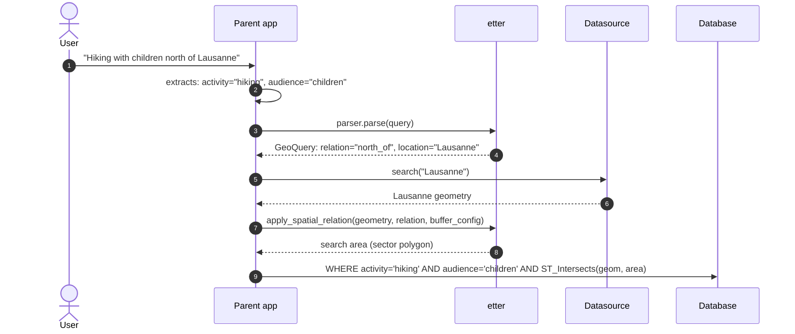

# Getting Started

## What is etter?

**etter** (/ˈɛtɐ/, Swiss German) — the boundary marking the edge of a village or commune.

etter transforms natural language location queries into structured geographic filters. It uses LLMs to understand multilingual queries and extract spatial relationships, returning typed Pydantic models your application can act on.

**Key principle:** etter has one responsibility — extract the geographic filter. It does not identify features, filter attributes, or execute searches.



## Installation

```bash
pip install etter
```

With PostGIS datasource support:

```bash
pip install "etter[postgis]"
```

## Quick Start

```python
from langchain.chat_models import init_chat_model
from etter import GeoFilterParser
import os

llm = init_chat_model(
    model="gpt-4o", temperature=0, api_key=os.getenv("LLM_API_KEY")
)

parser = GeoFilterParser(llm=llm)
result = parser.parse("north of Lausanne")

print(result.spatial_relation.relation)       # "north_of"
print(result.reference_location.name)         # "Lausanne"
print(result.buffer_config.distance_m)        # 10000
print(result.confidence_breakdown.overall)    # 0.95
```

See [`GeoFilterParser`](../api/etter.html#GeoFilterParser) for the full constructor signature and options.

## From Query to Search Area

`parse` only tells you *what* the filter is. To get a geometry you can query with, resolve the reference location in a [datasource](./datasources) and apply the spatial relation to it:

```python
from etter import SwissNames3DSource, apply_spatial_relation

source = SwissNames3DSource("data/swissnames3d/")

geo_query = parser.parse("hiking north of Lausanne")
ref = geo_query.reference_location
features = source.search(ref.name, type=ref.type)

area = apply_spatial_relation(
    features[0]["geometry"],
    geo_query.spatial_relation,
    geo_query.buffer_config,
)
# area is a GeoJSON geometry dict (WGS84): a 90° sector north of Lausanne
```

`search` returns candidates ranked by relevance; picking the first one is the simplest strategy, but you can also let the user choose. Passing `type` filters the candidates, so if the LLM inferred the wrong type the list can be empty — retry without it (see [Type System](./datasources#type-system)). If one place is split across several records, pass the list of their geometries instead — they are unioned before the relation is applied.

Use `geometry_format="wkt"` or `"wkb"` to get a value you can hand straight to your database (e.g. `ST_GeomFromText(:area, 4326)` in PostGIS). See [Spatial Relations](./spatial-relations#output-geometry-format).

## Understanding the Result

A [`GeoQuery`](../api/etter.html#GeoQuery) has four parts you will use:

- **`spatial_relation`**: the relation name (`"north_of"`) and its category (`containment`, `buffer`, `directional` or `clipping`). `explicit_distance` holds the distance in metres when the query states one ("within 5 km").
- **`reference_location`**: the place as named in the query (`name`) and the LLM's guess at its kind (`type`, e.g. `"city"`, `"lake"`). Pass both to your datasource's `search`.
- **`buffer_config`**: how far to buffer, for buffer and directional relations; `None` for containment and clipping. `inferred=True` means the distance is a default rather than something the user said. `apply_spatial_relation` then replaces it with a value sized to the reference geometry and updates `buffer_config.distance_m` in place — in the example above, 10 000 m becomes 1 500 m for Lausanne. See [Area-Based Distance Inference](./spatial-relations#area-based-distance-inference).
- **`confidence_breakdown`**: scores between 0 and 1 for the whole parse (`overall`), the location and the relation, plus the LLM's `reasoning`. See [confidence and strict mode](./using-the-parser#confidence-and-strict-mode).

## Next Steps

- [Using the Parser](./using-the-parser): choosing an LLM, async, streaming, batching, confidence thresholds and prompt customisation
- [Spatial Relations](./spatial-relations): the 21 built-in relations and how to register your own
- [Datasources](./datasources): the bundled datasources, PostGIS, and writing your own
- [Error Handling](./error-handling): what etter raises and how to handle it
- [LangChain Integration](./langchain): extracting your own fields in the same LLM call, and building chains
